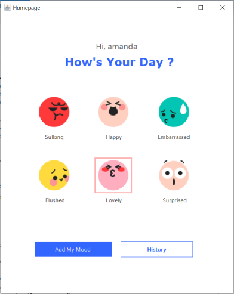
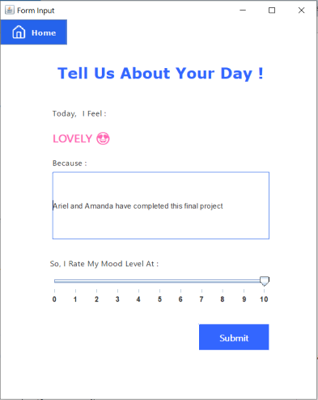
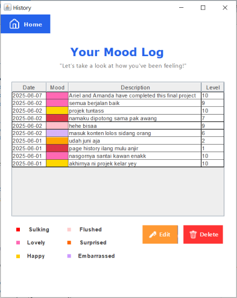
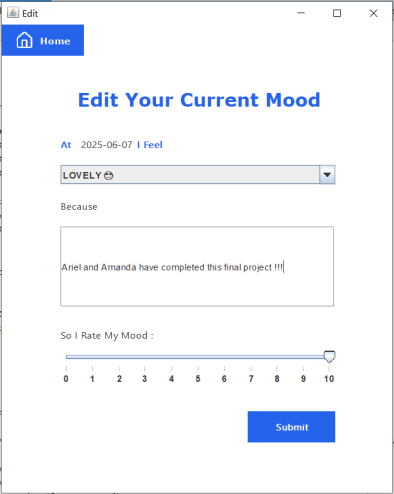

# 😎 MoodLog. : Mood Tracker - Final Project

A simple application for tracking and managing your daily mood. This Java-based application was built as a final project using the **Model-View-Controller (MVC)** architecture with **Java Swing** for the GUI and **MySQL** as the backend database.

## 👩‍💻 Project by

- **Vincentius Ariell Sorongan** — 123230131
- **Amanda Latifa** — 123230138

## 📌 Features

- 🔐 User Authentication (Sign Up & Login)
- 📅 Add Daily Mood Entry (with mood category & notes)  
- 📖 View Mood History
- ✏️ Edit or Delete Existing Entries
- 💾 Local database support (MySQL)

| Login Screen                           | Sign Up Screen                         | Homepage Screen                           |
|:----------------------------------------:|:----------------------------------------:|:------------------------------------:|
|  |  |  |

| Form Screen                           | History Screen                         | Edit Screen                           |
|:----------------------------------------:|:----------------------------------------:|:------------------------------------:|
|  |  |  |

## 📁 Project Structure
- **controllers/**: Handles logic and communication between models and views.
- **models/**: Contains setter and getter.
- **views/**: Swing-based GUI (Login, Sign Up, History, etc.)
- **helpers/**: Utilities like database connection (`DBHelper`) that include the query.
- **Main.java**: Entry point of the application.

## 🛠️ Technologies Used

  
  
  

