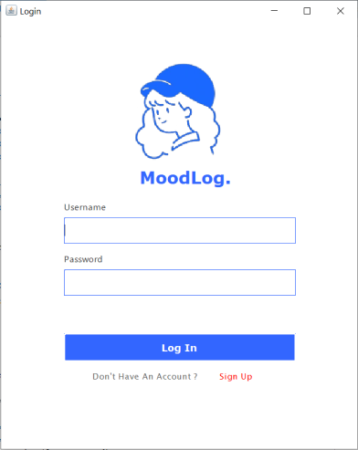

# 😄 MoodLog. : Mood Tracker - Final Project

A simple application for tracking and managing your daily mood. This Java-based application was built as a final project using the **Model-View-Controller (MVC)** architecture with **Java Swing** for the GUI and **MySQL** as the backend database.

## 📌 Features

- 🔐 User Authentication (Sign Up & Login)

|  |  |
|:------------------------------------:|:----------------------------------------:|
| Login Screen                         | Sign Up Screen                           |

- 📅 Add Daily Mood Entry (with mood category & notes)

|  |  |
|:------------------------------------:|:----------------------------------------:|
| Homepage Screen                         | Form Screen                           |
  
- 📖 View Mood History
- ✏️ Edit or Delete Existing Entries

|  |  |
|:------------------------------------:|:----------------------------------------:|
| History Screen                         | Edit Screen                           |

- 💾 Local database support (MySQL)

## 🛠️ Technologies Used

- **Java** (Java Swing for UI)
- **MySQL** (for storing mood data)
- **JDBC** (Java Database Connectivity)
- **MVC Architecture**

## 📁 Project Structure
- **controllers/**: Handles logic and communication between models and views.
- **models/**: Contains setter and getter.
- **views/**: Swing-based GUI (Login, Sign Up, History, etc.)
- **helpers/**: Utilities like database connection (`DBHelper`) that include the query.
- **Main.java**: Entry point of the application.
